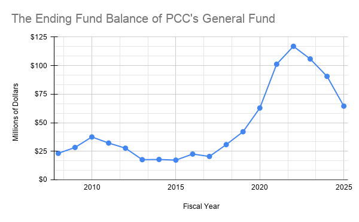

# PCC's Supposed Financial Struggles

Leadership at Portland Community College communicated that PCC is not financially stable and that PCC needs to prepare for uncertain financial times.
“For the first time in decades, there are no extra funds to move around and now, instead of pulling from unspent budget dollars, we have to make trade-offs between one area of the budget and another,” Dr. Adrien Bennings stated in [an email to staff in October 2025](https://drive.google.com/file/d/1jE2EgroJPSQttAHtwlyLuGS7tBZaneGR/view).
To resolve this budget crisis, leadership has proposed increasing the budgeted Ending Fund Balance from 9% to 12%, which would result in [$14mil in cuts](https://www.pcc.edu/about/wp-content/uploads/sites/98/2025/09/2025-2027-budget-adopted.pdf).

As a result, PCC [has threatened to cut several popular programs](https://www.wweek.com/news/schools/2025/07/23/portland-community-college-has-slated-a-beloved-music-program-for-closure/), including Music and Sonic Arts, Gerontology, and Russian.
PCC has also [refused to meet student demand to run more sections of popular classes that students need to graduate]( https://drive.google.com/file/d/1jE2EgroJPSQttAHtwlyLuGS7tBZaneGR/view).
PCC’s two unions, the Federation for Faculty and Academic Professionals and the Federation for Classified Employees, [recently went on strike for three weeks](https://portlandtribune.com/2026/03/31/pcc-strike-ends-after-3-weeks/) because Leadership did not offer either bargaining unit a Cost of Living Adjustment that kept up with inflation.

# PCC's Historic Ending Fund Balance

We were curious about PCC's financial situation, so we dug into it.
We took data from PCC's publicly available [Annual Comprehensive Financial Reports](https://www.pcc.edu/about/administration/budget/) and made some charts to help understand what's going on.

As you can see from the above graph:
* From FY2008 through FY2018, the Ending Fund Balance hovered between $17mil and $37mil, roughly 9% of expenses.
The Ending Fund Balance fluctuated throughout the years as our financial situation changed. 

* From FY2020 through FY2022, the Ending Fund Balance increased to $116mil.
During the COVID-19 Pandemic, PCC reported that it received [nearly $40mil in aid through the Higher Education Emergency Relief Fund](https://www.pcc.edu/news/2021/06/pcc-distributing-nearly-40-million-in-covid-relief-grants-for-students-in-need/).

* Once the Emergency Grants expired in FY2023, PCC's Ending Fund Balance decreased.
In FY2025, PCC reported that the Ending Fund Balance was $64,500,000.

# What caused the Ending Fund Balance to decrease?

It would be easy to suppose that expenses increased.
However, this is mostly due to transfers _out_ of the General Fund.
This money is staying within PCC, it's just being allocated to other sources.

Below are the funds that received transfers amounting to at least $1,000,000 since FY2023.

| Year | Fund               | Transfers In |
| -----| ------- |--------|
| 2023 | Capital Projects   | $6,080,391   |
| 2023 | Risk Management Fund | $1,964,000 |
| 2023 | Bookstore Fund | $1,750,398 |
| 2023 | Food Service Fund | $1,502,000 |
| 2024 | Capital Projects | $11,400,000 |
| 2024 | Risk Management Fund | $1,285,611 |
| 2025 | Capital Projects Fund | $5,000,000 |
| 2024 | Risk Management Fund | $1,407,772 |

A few notes on these transfers:
* The Bookstore and Food Services Funds did not receive any transfers in FY2024 or FY2025.
It was not typical for either of these funds to receive such large transfers.
These transfers likely happened to replenish these funds after the pandemic.
* The transfers to the Capital Projects Fund in FY2024 and FY2025 correspond with the amounts budgeted toward the WorkDay transition for the next Fiscal Year.
* Prior to FY2020, the Risk Management Fund never received transfers greater than $1,000,000.
The Risk Management Fund has increased substantially in the last several years. In FY2013, the Risk Management Fund's Ending Fund Balance was $3,656,107;
in FY2025, the Risk Management's Ending Fund Balance was $17,390,460, which is 4.76 times its Ending Fund Balance in FY2023.

# So where does that leave us?

The General Fund's Ending Fund Balance is still $64,500,000, which is 21.6% of operating expenditures.
This is significantly higher than it was before the pandemic and also 2.7x the amount that [PCC's Board Policies](https://www.pcc.edu/board/policies/b510/) require PCC to keep on reserve.
The Ending Fund Balance is decreasing because PCC is choosing to invest in strategic projects and to boost the Food Service Fund and the Bookstore Fund.
This is what a college is _supposed_ to do when it has extra money on reserve.